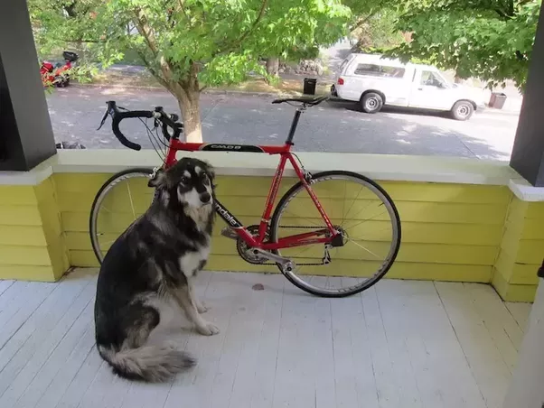

## YOLOv4 Inference
### 简要介绍

本项目使用 PyTorch 构建 YOLOv4 模型, 没有在代码的层面上去解析 yolov4.cfg 配置文件, 而是根据 [Netron](https://github.com/lutzroeder/netron) 可视化的结果, 直接搭建模型

<br>

### 目录结构

```
.
├── image
│   └── demo.png      默认使用该图像推理
├── main.py           解析命令行和推理
├── model.py          YOLOv4 的网络模型
├── README.md
├── requirements.txt
└── utils.py          过滤和绘制目标框

1 directory, 6 files
```

<br>

### 网络模型

#### 卷积层

##### ConvBNMish

YOLOv4 的 Backbone 中全部使用这种卷积层, 其后接 BatchNorm 且不带偏置

```python
class ConvBNMish(nn.Sequential):
    def __init__(self, in_channels, out_channels, kernel_size, stride=1):
        padding = (kernel_size - 1) // 2

        super().__init__(
            nn.Conv2d(in_channels, out_channels, kernel_size, stride, padding, bias=False),
            nn.BatchNorm2d(out_channels),
            Mish()
        )
```

##### ConvBNLeakyReLU

在 Backbone 和 YOLO Layer 前一层之间使用这种卷积层, 跟上边的卷积层基本相同, 只是更换了激活函数

```python
class ConvBNLeakyReLU(nn.Sequential):
    def __init__(self, in_channels, out_channels, kernel_size, stride=1):
        padding = (kernel_size - 1) // 2

        super().__init__(
            nn.Conv2d(in_channels, out_channels, kernel_size, stride, padding, bias=False),
            nn.BatchNorm2d(out_channels),
            nn.LeakyReLU(0.1, inplace=True)
        )
```

##### Conv

 YOLO Layer 前一层使用普通的卷积层, 该卷积带有偏置

<br>

### route

如果 route 个数为 1, 表示引出支路

如果 route 个数大于 1(个数为 2 或 4), 表示将相同尺寸的特征图叠加, BxCxHxW中 C 的个数增加其余维度不变

<br>

### shortcut

将两个相同维度的特征图相加, 前后维度不变, 其后可接激活函数, <font color="brown">如果使用 "linear" 激活函数, 则表示直接输出</font>

<br>

#### 向上采样

使用 2*2 数组示例

```python
import torch
# [[0, 1]
#  [2, 3]]
img = torch.arange(4).view(2,2)
# [[0, 0, 1, 1]
#  [0, 0, 1, 1]
#  [2, 2, 3, 3]
#  [2, 2, 3, 3]]
ex = img.view(2,1,2,1).expand(-1,2,-1,2).contiguous().view(4,4)
```

<br>

### 加载权重

使用 PyTorch 定义网络模型时, 在 `__init__` 函数中所有卷积层出现的顺序与 `yolov4.cfg` 中的 "convolutional" 的顺序一致, 所以仅需依次加载 `yolov4.weights` 


YOLOv4 中的卷积层有两种, 一种是后接 BatchNorm 但没有 Bias 的卷积层; 另一种是在末端 YOLO Layer 的卷积层, 这一种带有偏置 Bias 但后面没有 BatchNorm

<br>

### 运行推理

```shell
$ python3 main.py  --weight ~/Datasets/YOLOv4.weights
```

默认使用 image 下的 demo.png



推理图片默认命名为 detect.png, 且与原始图片位于同一目录


<br>

### 进度

- [x] Infer
- [ ] Train
- [ ] TensorRT